%Parallel I/O
%Jonathan Dursi

##Agenda

* Intro to I/O
* MPI-IO
* HDF5, NetCDF4
* Parallel HDF5/NetCDF4
* ADIOS

## Data is getting bigger


* Increase in computing power makes simulations larger/more frequent
* Increase in sensor technology makes experiments/observations larger
* Data sizes that used to be measured in MB/GB now measured in TB/PB.
* Easier to generate the data than
to store it:


__Economist, 27 Feb 2010__


## Disks are slower than CPUs (and getting slower)

*  Disk data from"The future of magnetic storage technology", Thompson & Best, and Tom's Hardware;
*  MIPS data fromWikipedia,"Instructions per Second".


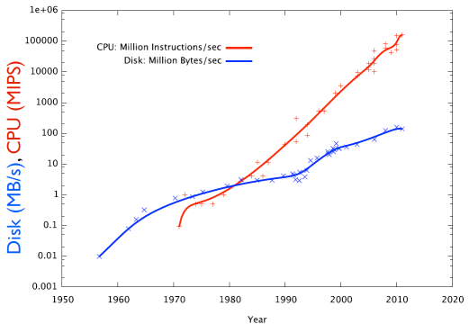

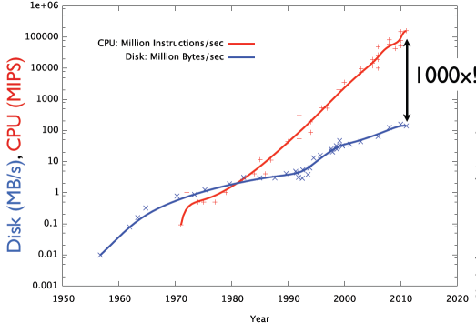

##Understanding storage performance

- Data rate: MB/s
    - Peak or sustained
    - Write faster than read
    - Network analogy: bandwidth
    
- IOPS: I/O Operations Per Second
    - open, close, seek, read, write
    - Network analogy: 1/latency


    Device     | Bandwidth (MB/s) | IOPS
	-----------|------------------|------------
	SATA HDD   |  100             |  100
	SSD        |  250             |  10000


HD:

  > Open, Write, Close 1000x1kB files: 30.01s (eff: 0.033 MB/s)
    
  > Open, Write, Close 1x1MB file: 40ms (eff: 25 MB/s)

SSD: 

  > Open, Write, Close 1000x1kB files: 300ms (eff: 3.3 MB/s)
   
  > Open, Write, Close 1x1MB file: 4ms (eff: 232 MB/s)


- SSDs are much faster at IOPS:
  * No physical mechanisms that must move to file position
  * Read ~ as fast as write
* But still latency at controller, system calls, etc.
* SSDs will always be much more expensive than disk per unit storage - disk isn't going away.


## Planning your I/O

* Parallel computation, several options.
* Everyone sends data to process 0
* Process 0 writes.
* Serialize I/O - huge bottleneck.


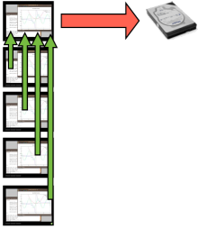

* Parallel computation,several options. 
* Each process writes a file, possibly to local disk.
* Postpones the problem - how do you analyze, or restart with different # of procs?

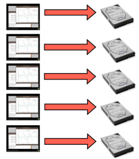

* Parallel computation, several options.
* We're going to learn to avoid doing this by using Parallel I/O
* **Coordinated** single output of multiple processes.


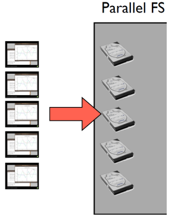

## Where, how you do I/O matters.


* Binary - smaller files, *much* faster to read/write.
* You're not going to read GB/ TB of data yourself; don't bother trying.
* Write in 1 chunk, rather than a few #s at a time.


Timing data: writing 128M double-precision numbers

* *All* disk systems do best when reading/writing large, contiguous chunks
* I/O operations (IOPS) are themselves expensive
* moving around within a file 
* opening/closing
* Seeks - 3-15ms - enough time to read 0.75 MB!

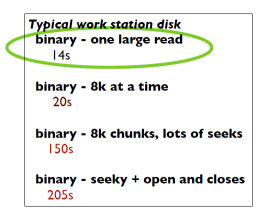

Timing data: reading 128M double-precision numbers

* RAM is much better for random accesses
* Use right storage medium for the job!
* Where possible, read in contiguous large chunks, do random access in memory 
* Much better if you use most of data read in

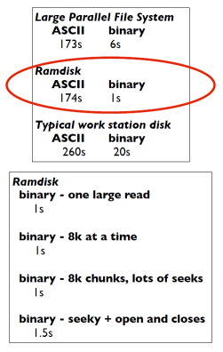

## Parallel I/O and large file systems

* Large disk systems featuring many servers, disks
* Can serve files to many clients concurrently
* Parallel File Systems -
* Lustre, Panasas, GlusterFS, Ceph, GPFS...

__SciNet ~2k drives__

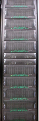


## SciNet's File Systems


* 2x DCS9900 couplets
* 1,790 1TB SATA disk drives
* 1.4 PB of storage
* Single GPFS domain, accessed by all machines (TCS and GPC).
* Data to compute nodes via IB


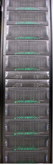


* Designed for HPC workloads
* High bandwidth to large files - big data.
* Does not do well with millions of little files:
	- wastes disk space (4MB block size)
    - lots of small scattered access is *terrible* for performance, even on desktop; multiply by hundreds of processors, can be
disastrous


## Understanding storage performance

Device      | Bandwidth (MB/s) | IOPS
----------  | -----------------| -----------
SATA HDD    |  100             |  100
SSD         |  250             |  10000
SciNet GPFS |  5000            |  30000


(SciNet GPFS used by ~3000 nodes.)

## Where, how you do I/O matters.

* Well built parallel file systems can greatly increase bandwidth
* Many pipes to network (servers),many spinning disks (bandwidth off of disks)
* But typically even worse penalties for seeky/IOPSy operations (coordinating all those disks.)
* Parallel FS can help with big data in two ways


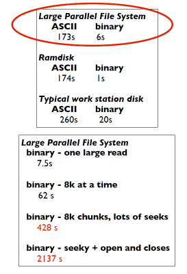

## Striping data across disks

* Single client can make use of multiple disk systems simultaneously
* "Stripe" file across many drives 
* One drive can be finding next block while another is sending current block


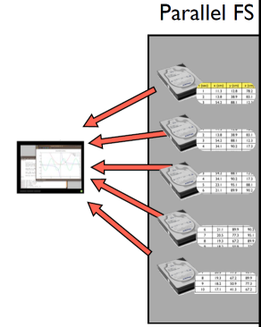

## Parallel operations on separate data

* Or can do truly parallel operations
* multiple clients doing independent work
* Easy parallelism (good for lots of small data) - process many small files separately

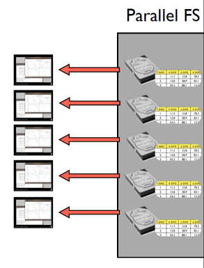

* Or can do truly parallel operations
* multiple clients doing independent work
* Easy parallelism (good for lots of small data) - process many small files separately
* Harder parallelism - each does part of a larger analysis job on a big file.

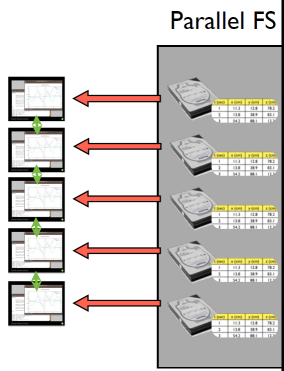


## Data files must take advantage of parallel I/O

* For parallel operations on single big files, parallel filesystem isn't enough
* Data must be written in such a way that nodes can efficiently access relevant subregions
* HDF5, NetCDF formats typical examples for scientific data


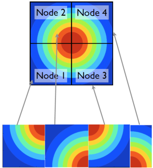


**Disk: (HDF5, NetCDF, pVTK..)**

## These formats are *self-describing*

* HDF5, NetCDF have other advantages anyway
* Binary
* Self describing - contains not only data but names, descriptions of arrays, etc
* Many tools can read these formats
* Big data - formats matter


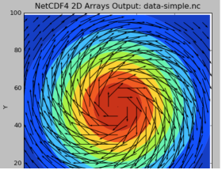


```
$ ncdump -h data-simple-fort.nc 
netcdf data-simple-fort {
dimensions:
 X = 100 ;
 Y = 100 ;
 velocity components = 2 ;
variables:
 double Density(Y, X) ;
 double Velocity(Y, X, velocity components) ;
}

```

## Coordinating I/O

* Multiple nodes all accessing same filesystem.
* To prevent anarchy, locks for some requested accesses.
* File broken up into lock units, locks handed out upon request.
* "False sharing", etc, possible.
* Files **and** directories.
* Makes (some) IOPS even more expensive


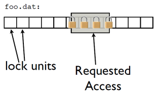


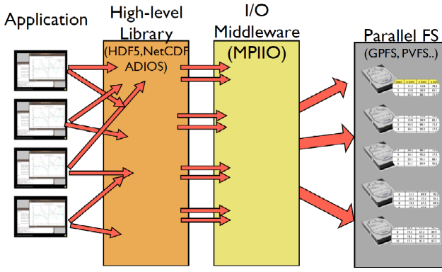

## Abstraction Layers


* High Level libraries can simplify programmers tasks
	* Express IO in terms of the data structures of the code, not bytes and blocks
* I/O middleware can coordinate, improve performance
	* Data Sieving
	* 2-phase I/O

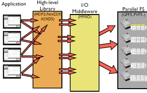


## Data Sieving


* Combine many noncontiguous IO requests into fewer, bigger IO requests
* "Sieve" unwanted data out
* Reduces IOPS, makes use of high bandwidth for sequential IO


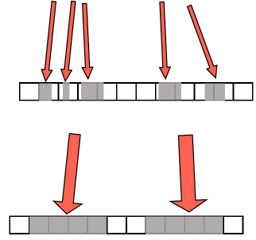

## Two-Phase IO

* Collect requests into larger chunks
* Have individual nodes read big blocks
* Then use network communications to exchange pieces
* Fewer IOPS, faster IO
* Network communication usually faster


## MPI-IO

* Part of MPI-2 standard
* Started at IBM Watson
* Maps I/O reads and writes to message passing 
* ROMIO is the implementation found in MPICH2, OpenMPI
* Really only widelyavailable scientific computing parallel I/O middleware


```
$ cd parIO
$ source parallellibs
$ cd samples/mpiio
$ make
....

$ mpiexec -n 4 ./helloworldc
Rank 0 has message <Hello >
Rank 1 has message <World!>
Rank 2 has message <Hello >
Rank 3 has message <World!>

$ cat helloworld.txt 
Hello World!Hello World! $
```


```
#include <stdio.h>
#include <string.h>
#include <mpi.h>

int main(int argc, char **argv) {
int ierr, rank, size;
MPI_Offset offset;
MPI_File file;
MPI_Status status;
const int msgsize=6;
char message[msgsize+1];

ierr = MPI_Init(&argc, &argv);
ierr|= MPI_Comm_size(MPI_COMM_WORLD, &size);
ierr|= MPI_Comm_rank(MPI_COMM_WORLD, &rank);

if ((rank % 2) == 0) strcpy (message, "Hello "); else strcpy (message, "World!");

offset = (msgsize*rank);

MPI_File_open(MPI_COMM_WORLD, "helloworld.txt", MPI_MODE_CREATE|MPI_MODE_WRONLY,
MPI_INFO_NULL, &file);
MPI_File_seek(file, offset, MPI_SEEK_SET);
MPI_File_write(file, message, msgsize, MPI_CHAR, &status);
MPI_File_close(&file);

MPI_Finalize();
return 0;
}
```


```
program MPIIO_helloworld
 use mpi
 implicit none

 integer(mpi_offset_kind) :: offset
 integer, dimension(mpi_status_size) :: wstatus
 integer, parameter :: msgsize=6
 character(msgsize) :: message
 integer :: ierr, rank, comsize, fileno

 call MPI_Init(ierr)
 call MPI_Comm_size(MPI_COMM_WORLD, comsize, ierr)
 call MPI_Comm_rank(MPI_COMM_WORLD, rank, ierr)

 if (mod(rank,2) == 0) then
 message = "Hello "
 else
 message = "World!"
 endif

 offset = rank*msgsize
 
  call MPI_File_open(MPI_COMM_WORLD,"helloworld.txt",ior(MPI_MODE_CREATE,MPI_MODE_WRONLY),& 
 MPI_INFO_NULL, fileno, ierr)
 call MPI_File_seek (fileno, offset, MPI_SEEK_SET, ierr)
 call MPI_File_write(fileno, message, msgsize, MPI_CHARACTER, wstatus, ierr)
 call MPI_File_close(fileno, ierr)

 call MPI_Finalize(ierr)!

end program MPIIO_helloworld
```


## MPI-IO  Hello  World


```
mpiexec -n 4 ./helloworldc
```

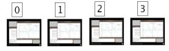


```
if ((rank % 2) == 0) !
 strcpy (message, "Hello "); !
else !
 strcpy (message, "World!");!
```


``
MPI_File_open(MPI_COMM_WORLD,"helloworld.txt",MPI_MODE_CREATE|MPI_MODE_WRONLY,!
MPI_INFO_NULL, &file);
``


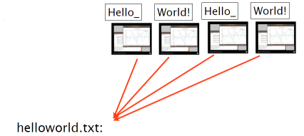

```
offset = (msgsize*rank);!
!
MPI_File_seek(file, offset, MPI_SEEK_SET);!
```
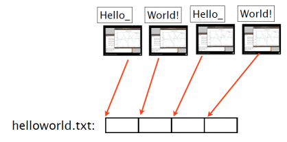
```
MPI_File_write(file, message, msgsize, MPI_CHAR, &status);!
```

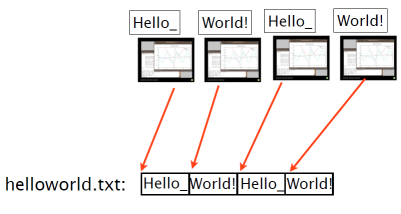


```
MPI_File_close(&file);
```


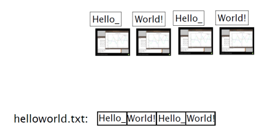


 **Usual MPI startup/teardown boilerplate**


```
#include <stdio.h>
#include <string.h>
#include <mpi.h>

int main(int argc, char **argv) {
int ierr, rank, size;
MPI_Offset offset;
MPI_File file;
MPI_Status status;
const int msgsize=6;
char message[msgsize+1];

ierr = MPI_Init(&argc, &argv);
ierr|= MPI_Comm_size(MPI_COMM_WORLD, &size);
ierr|= MPI_Comm_rank(MPI_COMM_WORLD, &rank);

if ((rank % 2) == 0) strcpy (message, "Hello "); else strcpy (message, 
offset = (msgsize*rank);!
!
MPI_File_open(MPI_COMM_WORLD, "helloworld.txt", MPI_MODE_CREATE|MPI_INFO_NULL, &file);
MPI_File_seek(file, offset, MPI_SEEK_SET);
MPI_File_write(file, message, msgsize, MPI_CHAR, &status);
MPI_File_close(&file);

MPI_Finalize();
return 0;
}
```

## MPI\_File\_Open

 Communicator; __collective__ operation.

```
call MPI_File_Open( integer communicator,
character(*) *filename,
integer mode,
integer info,
integer handle,
integer ierr);
```

```
int MPI_File_Open( MPI_Comm communicator,
char *filename,
int mode,
MPI_Info info,
MPI_File *handle);
```

Info allows us to send extra hints to MPI-IO layer about file(performance tuning, special case handling)

MPI_INFO_NULL: no extra info.


## Modes for MPI File Open():

  
  MPI\_MODE\_RDONLY          |   read-only 
-----------------------------|------------------ 
  MPI\_MODE\_RDWR            |   read-only  
  MPI_MODE_RDWR              |   read-write          
  MPI\_MODE\_WRONLY          |   write-only     
  MPI\_MODE\_CREATE          |   Create if doesn't exist.
  MPI\_MODE\_APPEND          |   On open, file pointers at end of file. 
  MPI\_MODE\_EXCL            |   Fail if try to create, does exist.
  MPI\_MODE\_UNIQUE_OPEN     |   No one else is using this.
  MPI\_MODE\_SEQUENTIAL      |   Will be sequential access only.                 
  MPI\_MODE\_DELETE_ON_CLOSE |   Delete when done. (OOC/scratch).

     

## MPI\_File\_Seek:
```
int MPI_File_seek( MPI_File mpi_fh,!
MPI_Offset offset,!
int mode);
```

```

call MPI_File_seek( integer :: mpi_fh,!
integer(mpi_offset_kind) :: offset,!
integer :: mode!
integer :: ierr)!
```
  
   

 MPI\_SEEK\_SET   |   Set file pointer to position offset
  ------------------|------------------ 
 MPI\_SEEK\_CUR    |   pointer <- current position + offset
 MPI\_SEEK\_END   |   pointer <- end of file - offset
 


**Not** collective; each adjusts its own local file pointer**


## MPI\_File\_write:

```
	int MPI_File_write(MPI_File fh, 
	void *buf, 
	int count, 
	MPI_Datatype datatype,
	MPI_Status *status)
```
```
	call MPI_File_write( integer :: mpi_fh,
	buffer,
	integer :: count
	integer :: datatype
	integer :: status(MPI_STATUS_SIZE)
	integer :: ierr)
```

__Not__ collective; each writes.

* MPI File write is very much like a MPI_Send.
* "Sending" count of datatype from buf "to" the file.
* Here, writing 6 MPI_CHARs. 
* Contiguous in memory starting in buffer.
* Status like a receive -- contains info about amount of data actually written, etc.

```
int MPI_File_write(MPI_File fh, void *buf, int count, MPI_Datatype datatype, MPI_Status *status)
```


* To write out data that is noncontiguous in memory, same as MPI_Sending non-contig data:
	* Create type that describes data layout in memory
	* "Send" in units of that type. 
*  Noncontiguous data in memory is written out contiguously to the file, starting at the current (local) file pointer.


```
call MPI_Type_vector(count, blocklen, stride, MPI_CHARACTER, !
everyother, ierr)!
```


```
integer, parameter :: msgsize=6, strsize=12
character(strsize) :: message
integer :: everyother

....

if (mod(rank,2) == 0) then
message = "H@e#l*l^o* A"
else 
message = "WFoQr#l>d@!_"
endif

... 

call MPI_Type_vector(msgsize, 1, 2, MPI_CHARACTER, everyother, ierr)
call MPI_Type_commit(everyother, ierr)

call MPI_File_open(MPI_COMM_WORLD, "helloworld-nc.txt", ior(MPI_MODE_CREATE,MPI_MODE_WRONLY),&
MPI_INFO_NULL, fileno, ierr)

call MPI_File_seek (fileno, offset, MPI_SEEK_SET, ierr)
call MPI_File_write(fileno, message, 1, everyother, wstatus, ierr)
call MPI_File_close(fileno, ierr)
```

## Seek + Write


* Works, but:
	* Very low leel (gets complicated for less trivial data layouts)
	* Completely independent operations (seek, write)
	* Hard for any middleware to coordinate, improve anything. 
	* Could do this with POSIX I/O.


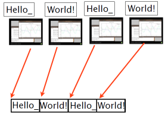


## MPI\_File\_write\_at:


```
offset = rank*msgsize

call MPI_File_open(MPI_COMM_WORLD, "helloworld-at.txt", &
ior(MPI_MODE_CREATE,MPI_MODE_WRONLY), &
MPI_INFO_NULL, fileno, ierr)

call MPI_File_write_at(fileno, offset, message, msgsize, &
MPI_CHARACTER, wstatus, ierr)
call MPI_File_close(fileno, ierr)
```

```
offset = (msgsize*rank);

MPI_File_open(MPI_COMM_WORLD, "helloworld-at.txt",
MPI_MODE_CREATE|MPI_MODE_WRONLY,
MPI_INFO_NULL, &file);

MPI_File_write_at(file, offset, message, msgsize, MPI_CHAR, &status);
MPI_File_close(&file);
```

```
int MPI_File_write_at(MPI_File fh,
MPI_Offset offset
void *buf, 
int count, 
MPI_Datatype datatype,
MPI_Status *status)
```

```
call MPI_File_write_at( integer :: mpi_fh,
integer(MPI_OFFSET_KIND) :: offset,
buffer,
integer :: count
integer :: datatype
integer :: status(MPI_STATUS_SIZE)
integer :: ierr)
```
**Writes at a given offset**


## Write_at

* Seek (relative to current, local, file pointer) + write in one operation.
* More explicit about what is going to happen - some opt. possible.
* But actions of individual processors still independent - no collective optimization possible.


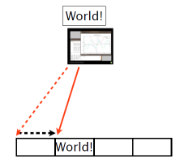

## MPI\_File\_write\_at\_all:


```
	offset = rank*msgsize
	call MPI_File_open(MPI_COMM_WORLD, "helloworld-at.txt", &
	ior(MPI_MODE_CREATE,MPI_MODE_WRONLY), &
	MPI_INFO_NULL, fileno, ierr)
	call MPI_File_write_at_all(fileno, offset, message, msgsize, &
	MPI_CHARACTER, wstatus, ierr)
	call MPI_File_close(fileno, ierr)
```


```
	offset = (msgsize*rank);
	MPI_File_open(MPI_COMM_WORLD, "helloworld-at.txt",
	MPI_MODE_CREATE|MPI_MODE_WRONLY,
	MPI_INFO_NULL, &file);
	MPI_File_write_at_all(file, offset, message, msgsize, 
	MPI_CHAR, &status);
	MPI_File_close(&file);
```


```
	int MPI_File_write_at_all(MPI_File fh,
	MPI_Offset offset
	void *buf, 	
	int count, 
	MPI_Datatype datatype,
	MPI_Status *status)
```
```
	call MPI_File_write_at_all( integer :: mpi_fh,
	integer(MPI_OFFSET_KIND) :: offset,
	buffer,
	integer :: count
	integer :: datatype
	integer :: status(MPI_STATUS_SIZE)
	integer :: ierr)
```
**Writes at a given offset - Collective!**

##Write\_at\_all

- Much more explicit about what is going to happen globally.
- Collective operation.	
- All processors participate.
- Higher order optimizations possible.


##Non-contiguous in file

- Imagine having to write out a 2d file as to the right, with rank 0 "owning" the yellow data, etc.
- (eg, an image, or a complete checkpoint of a 2d domain).
- Would have to do repeated seeks, writing out one row at a time... 

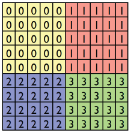

##MPI-IO File View

- int MPI\_File\_set\_view(
	
	MPI\_File fh,			/** displacement in bytes from start * */
	
	MPI\_Offset disp,		/** elementary type * */ 
	
	MPI\_Datatype etype,	/** file type; prob different for each proc * */ 
	
	MPI\_Datatype filetype, 	/** `native' or `internal' * */
	
	char  datarep,			/** `native' or `internal' * */
	
	MPI\_Info info)			/** MPI\_INFO\_NULL * */

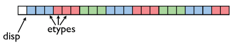

- int MPI\_File\_set\_view(
	MPI\_File fh,
	
	MPI\_Offset disp,		/** displacement in bytes from start * */

	MPI\_Datatype etype,	/** elementary type * */

	MPI\_Datatype filetype,	/** file type; prob different for each proc * */

	char datarep,			/** `native' or `internal' * */

	MPI\_Info info)			/** MPI\_INFO\_NULL * */

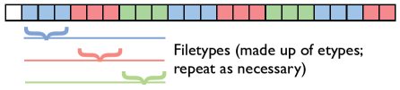

##MPI-IO File Write

```
int MPI_File_write_all(MPI_File fh, void *buf, int count, MPI_Datatype datatype, MPI_Status *status)

```

Writes (_all: collectively) to part of file **within view.**

## MPI\_Type\_create\_subarray

- MPI\_Type\_create\_subarray ; piece of a multi-dimensional array.
- *Much* more convenient for higher-dimensional arrays
- (Otherwise, need vectors of vectors of vectors...) 
- Here - starts = [0,0], subsizes=[5,5], sizes=[10,10].


```
	  int MPI_Type_create_subarray(
		 int ndims, int *array_of_sizes,
		 int *array_of_subsizes,
		 int *array_of_starts,
		 int order,
		 MPI_Datatype oldtype,
		 MPI_Datatype &newtype);
```
```
	  call MPI_Type_create_subarray(
		integer ndims, [array_of_sizes],
		[array_of_subsizes],
		[array_of_starts],
		order, oldtype,
		newtype, ierr)
```
```
	MPI_Type_create_subarray(2, globalsize, subsize, start, MPI_ORDER_C,
	MPI_CHAR, &viewtype);
	MPI_Type_commit(&viewtype); 

	offset = 0;

	MPI_File_open(MPI_COMM_WORLD, "viewtype.txt",
	MPI_MODE_CREATE|MPI_MODE_WRONLY,
	MPI_INFO_NULL, &file);

	MPI_File_set_view(file, offset, MPI_CHAR, viewtype,
	"native", MPI_INFO_NULL);

	MPI_File_write_all(file, &(mydata[0][0]), locnrows*locncols, MPI_CHAR, &status);
	MPI_File_close(&file);
 
 ```

write locnrows\*locncols contiguous MPI_CHARs to the (non-contiguous) view in file.

##MPI-IO hands-on

 - Fill in the blanks in sine.c or sinef.f90 to use MPI-IO to write out the 1-d array of sin(x).
 - Already written: decomposing the array, doing the calculation, MPI\_File\_open and MPI\_file\_close calls.
 - Make sine (sinf) and make sineplot (sinefplot) to build the code, and run it and plot the results.
 - Can use any of the approaches above
 - ~15 minutes.

#Formats for Scientific Data Management
### NetCDF4, HDF5, and whatnot

##Sample Code
```
$ cd parIO/netcdf

$ make 2darray-simple (C),or
$ make f2darray-simple (F90)

$ ./{f,}2darray-simple

$ ls *.nc
$ ../plots.py *.nc
```

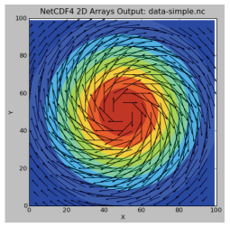


```
$ ./2darray-simple --help!
Options: 
	--nx=N (-x N): Set the number of grid cells in x direction.
	--ny=N (-y N): Set the number of grid cells in y direction.
	--filename=S (-f S): Set the output filename.
		
$ ./f2darray-simple --help
  Usage: f2darray-simple [--help] [filename [nx [ny]]]
		where filename is output filename, and
		nx, ny are number of points in x and y directions.
```


##What is this .nc file?

```
$ ncdump -h data-simple-fort.nc 
netcdf data-simple-fort {
dimensions:
X = 100 ;
Y = 100 ;
velocity\ components = 2 ;
variables:
double Density(Y, X) ;
double Velocity(Y, X, velocity\	components) ;
```


##NetCDF

- NetCDF is a set of libraries and formats for:
	- portable,
	- efficient
	- "self-describing"
- way of storing and accessing large arrays (eg, for scientific data)
- Current version is NetCDF4


```
$ ncdump -h data-simple-fort.nc 
netcdf data-simple-fort {
dimensions:
X = 100 ;
Y = 100 ;
velocity\ components = 2 ;
variables:
dou1ble Density(Y, X) ;
double Velocity(Y, X, velocity\components) ;
}
```
##NetCDF: *Portable*

- Binary files, but common output format so that different sorts of machines can share files. 
- Libraries accessible from C, C++,Fortran-77, Fortran 90/95/2003,python, etc. 


```
$ ncdump -h data-simple-fort.nc 
netcdf data-simple-fort {
dimensions:
X = 100 ;
Y = 100 ;
velocity\ components = 2 ;
variables:
double Density(Y, X) ;
double Velocity(Y, X, velocity\	components) ;
}
```
##NetCDF: *Self-Describing*

- Header contains the metadata to
describe the big data
- Lists:
	- Array names
	- Dimensions
	- *shared* dimensions - information about how the arrays relate
	- Other, related information
	

```
$ ncdump -h data-simple-fort.nc 
netcdf data-simple-fort {
dimensions:
X = 100 ;
Y = 100 ;
velocity\ components = 2 ;
variables:
double Density(Y, X) ;
double Velocity(Y, X, velocity\components) ;
}
```
##NetCDF: *Efficient*

- Binary, so less translation (as little is used as possible) 
- IO libraries themselves are written for performance
- API, data format makes it easy to efficiently read,write subregions of arrays (slices, or `hyperslabs')
- Still possible to make things slow - lots of metadata queries, modifications


```
		$ ncdump -h data-simple-fort.nc 
		netcdf data-simple-fort {
		dimensions:
		 X = 100 ;
		 Y = 100 ;
		 velocity\ components = 2 ;
		variables:
		 double Density(Y, X) ;
		 double Velocity(Y, X, velocity\components) ;
		}
```

- Include function definitions
- Create a new file, with name rundata.filename
- Clobber anything already in the file
- Test the return codes


```		
		#include "netcdf.h" /* Include function definitions */
		


		void writenetcdffile(rundata_t rundata, double **dens, 
		double ***vel) {
		/* identifiers */
		int file_id;

		...
		/* return status */
		int status;

		/* Create a new file - clobber anything existing */
		status = nc_create(rundata.filename, NC_CLOBBER, &file_id);
		/* netCDF routines return NC_NOERR on success */
		if (status != NC_NOERR) {
		fprintf(stderr,"Could not open file %s\n", rundata.filename);

```

```
subroutine writenetcdffile(rundata, dens, vel)
use netcdf /* Import definitions * /
implicit none
type(rundata_t), intent(IN) :: rundata
double precision, intent(IN), dimension(:,:) :: dens
double precision, intent(IN), dimension(:,:,:) :: vel

integer :: file_id
...
integer :: status
	 
create the file, check return code
/* Create file */
/*C definitions are NC_, F90 are NF90_*/
status = nf90_create(path=rundata%filename, cmode=NF90_CLOBBER,ncid=file_id)
if (status /= NF90_NOERR) then
	print *,'Could not open file ', rundata%filename 
	return
```	

##Writing a NetCDF File


- To write a NetCDF file, we go through the following steps:
	- **Create** the file (or open it for appending) 
	- **Define dimensions** of the arrays we'll be writing
	- **Define variables** on those dimensions
	- **End definition** phase 
	- **Write variables**  
	- **Close file**


```	
$ ncdump -h data-simple-fort.nc 
netcdf data-simple-fort {
dimensions:
X = 100 ;
Y = 100 ;
velocity\ components = 2 ;
variables:
double Density(Y, X) ;
double Velocity(Y, X, velocity\ components) ;
	}
```
```
integer :: file_id, xdim_id, ydim_id, vcomp_id
integer :: dens_id, vel_id
integer, dimension(2) :: densdimsWriting a NetCDF File
integer, dimension(3) :: veldims		
...
/*Define the dimensions in the file: name, size, id*/		
status = nf90_def_dim(file_id, 'X', rundata%nx, xdim_id)
status = nf90_def_dim(file_id, 'Y', rundata%ny, ydim_id) 
status = nf90_def_dim(file_id, 'velocity components', 2, vcomp_id)

/*Variables are defined in terms of these dims*/

densdims = (/ xdim_id, ydim_id /)
veldims = (/ vcomp_id, xdim_id, ydim_id /)

status = nf90_def_var(file_id, 'Density', NF90_DOUBLE, densdims, dens_id)
if (status /= NF90_NOERR) print *, trim(nf90_strerror(status)), ' Dens'
status = nf90_def_var(file_id, 'Velocity', NF90_DOUBLE, veldims, vel_id)

status = nf90_enddef(file_id)
```


```
/*Once you're done defining things,*/

status = nf90_enddef(file_id)
Write out the values

/*Writing data is easy.*/

status = nf90_put_var(file_id, dens_id, dens)
if (status /= NF90_NOERR) print *, trim(nf90_strerror(status)), ' Dens'
status = nf90_put_var(file_id, vel_id, vel)
if (status /= NF90_NOERR) print *, trim(nf90_strerror(status)), ' Vel'

/*Closing the file is important!		*/

status = nf90_close(file_id)
```

##Reading a NetCDF File

- Flow is slightly different
	- **Open** the file for reading
	- **Get dimension ids** of the the 	dimensions in the files
	- **Get dimension lengths** so you can allocate the files
	- **Get variable ids** so you can access the data
	- **Read variables**
	- **Close file**
		


```
	$ ncdump -h data-simple-fort.nc 
	netcdf data-simple-fort {
	dimensions:
	 X = 100 ;
	 Y = 100 ;
	 velocity\ components = 2 ;
	variables:
	 double Density(Y, X) ;
	 double Velocity(Y, X, velocity\ components) ;
	}
```

```
status = nf90_open(path=rundata%filename, mode=NF90_NOWRITE, ncid=file_id)

...
! find the dimensions
status = nf90_inq_dimid(file_id, 'X', xdim_id)
status = nf90_inq_dimid(file_id, 'Y', ydim_id)
status = nf90_inq_dimid(file_id, 'velocity components', vcomp_id)
! find the dimension lengths
status = nf90_inquire_dimension(file_id, xdim_id, len = rundata % nx)
status = nf90_inquire_dimension(file_id, ydim_id, len = rundata % ny )
status = nf90_inquire_dimension(file_id, vcomp_id,len = rundata % nvelcomp)
! now we can allocate variable sizes
allocate(dens(rundata%nx, rundata%ny)) !...etc...

status = nf90_inq_varid(file_id, 'Density', dens_id)
status = nf90_inq_varid(file_id, 'Velocity', vel_id)

status = nf90_get_var(file_id, dens_id, dens)
status = nf90_get_var(file_id, vel_id, vel)

status = nf90_close(file_id)
```
```
status = nc_open(rundata->filename, NC_NOWRITE, &file_id);

/* Get the dimensions */
status = nc_inq_dimid(file_id, "X", &xdim_id);
if (status != NC_NOERR) fprintf(stderr, "Could not get X\n");
status = nc_inq_dimid(file_id, "Y", &ydim_id);
status = nc_inq_dimid(file_id, "velocity component", &vcomp_id);

status = nc_inq_dimlen(file_id, xdim_id, &(rundata->nx));
status = nc_inq_dimlen(file_id, ydim_id, &(rundata->ny));
status = nc_inq_dimlen(file_id, vcomp_id, &(rundata->nveldims));

...
nc_inq_varid(file_id, "Density", &dens_id);
nc_inq_varid(file_id, "Velocity", &vel_id);

nc_get_var_double(file_id, dens_id, &((*dens)[0][0]));
nc_get_var_double(file_id, vel_id, &((*vel)[0][0][0]));

nc_close(file_id);
```

##A Better example

- The above example is much more austere than a typical NetCDF file 
- A more typical example is given in 2darray (or f2darray)
- make this, then run it
- ../plots.py data.nc
- (Same options as previous example)

```
$ ncdump -h data.nc 
netcdf data {
dimensions:
 X = 100 ;
 Y = 100 ;
 velocity\ component = 2 ;
variables:
 float X\ coordinate(X) ;
  X\ coordinate:units = "cm" ;
 float Y\ coordinate(Y) ;
  Y\ coordinate:units = "cm" ;
 double Density(X, Y) ;
  Density:units = "g/cm^3" ;
 double Velocity(velocity\
component, X, Y) ;
 Velocity:units = "cm/s" ;
}
```
```
float *x, *y;
const char *coordunit="cm";
... 
for (i=0; i<rundata.nx; i++) x[i] = (1.*i-rundata.nx/2.);
for (i=0; i<rundata.ny; i++) y[i] = (1.*i-rundata.ny/2.);
...
/* define the dimensions */
nc_def_dim(file_id, "X", rundata.nx, &xdim_id);
nc_def_dim(file_id, "Y", rundata.ny, &ydim_id);
nc_def_dim(file_id, "velocity component", 2, &vcomp_id);

/* define the coordinate variables,... */
/*Typically not only define dimensions but give coordinate values*/

nc_def_var(file_id, "X coordinate", NC_FLOAT, 1, &xdim_id, &xcoord_id);
nc_def_var(file_id, "Y coordinate", NC_FLOAT, 1, &ydim_id, &ycoord_id);

/* ...and assign units to them as an attribute */
nc_put_att_text(file_id, xcoord_id, "units", strlen(coordunit), coordunit);
nc_put_att_text(file_id, ycoord_id, "units", strlen(coordunit), coordunit);
```


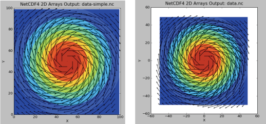

```
float *x, *y;! 
const char *coordunit="cm";
...
 x = (float *)malloc(rundata.nx * sizeof(float));
 y = (float *)malloc(rundata.ny * sizeof(float));
...
/* define the dimensions */
nc_def_dim(file_id, "X", rundata.nx, &xdim_id);
nc_def_dim(file_id, "Y", rundata.ny, &ydim_id);
nc_def_dim(file_id, "velocity component", 2, &vcomp_id);
/* define the coordinate variables,... */
nc_def_var(file_id, "X coordinate", NC_FLOAT, 1, &xdim_id, &xcoord_id);
nc_def_var(file_id, "Y coordinate", NC_FLOAT, 1, &ydim_id, &ycoord_id);

/* ...and assign units to them as an attribute */
/*Variables (or anything else) can have attributes: Name, and arbitrary data*/

nc_put_att_text(file_id, xcoord_id, "units", strlen(coordunit), coordunit);
nc_put_att_text(file_id, ycoord_id, "units", strlen(coordunit), coordunit);

```

##NetCDF Attributes

- Any NetCDF object (data set, dimension) can have an arbitrary number of attributes associated with it
- Name, and any type or size...
- Like a variable! (But can't access only part of it).
- Attributes are assumed to be "small", though.
- Stored in header information (not with big data)
- Don't put large arrays in there

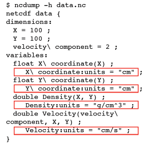


- Units are particularly useful attributes, as if a code needs data in some other units (MKS), can convert.

##Limits to Self-Description
 
- But what if some codes expect "centimetre" and you use cm? 
- Or their code uses "Dens" or "Rho" and yours uses "Density?" Or uses momentum rather than velocity?

##Conventions
- There are lists of conventions that you can follow for variable names, unit names, etc.
- If you are planning for interoperability with other codes, this is the way to go
- codes expecting data following (say) CF conventions for geophys should recognize data in that convention


##Big advantage of self-describing:

- Old program could easily read new file, even though data layout changed!
- Doesn't even need to know about attributes...
- New variables don't cause any problems - don't have to read them!
- Backwards compatibility
- But can look for them and use if available.


```
$ ncdump -h data.nc 
netcdf data {
dimensions:
 X = 100 ;
 Y = 100 ;
 velocity\ component = 2 ;
variables:
 float X\ coordinate(X) ;
  X\ coordinate:units = "cm" ;
 float Y\ coordinate(Y) ;
  Y\ coordinate:units = "cm" ;
 double Density(X, Y) ;
  Density:units = "g/cm^3" ;
 double Velocity(velocity\ component, X, Y) ! ! Velocity:units = "cm/s" ;
}
```

##Accessing subregions in file

- nc_put_var_type or nf90_put_var puts whole array(by default)
- Subarrays can be specified with starts and counts
 
 

```
start(1) = 4
start(2) = 5

count(1) = 6
count(2) = 2

nf90_put_var(file_id, dens_id,
data, START=start, COUNT=count)
```


```
start[0] = 3;
start[1] = 4;

count[0] = 6;
count[1] = 2;

nc_put_vara_double(file_id,
dens_id, start, count, data);
```


##Accessing subregions in file
- Note that NetCDF libraries accepts starting conventions of C, Fortran as appropriate.


- Another thing this is good for;arrays in NetCDF can have a dimension of unlimited size (eg, can grow) - NetCDF3, only one dimension, NetCDF4, any
- Can use for timesteps, for instance.
- Any access to such a dataset is necessarily via subregions.
    
#Fortran vs C array conventions
```
$ ncdump -h data.nc 
netcdf data {
dimensions:
 X = 100 ;
 Y = 100 ;
 velocity\ component = 2 ;
variables:
 float X\ coordinate(X) ;
 X\ coordinate:units = "cm" ;
 float Y\ coordinate(Y) ;
 Y\ coordinate:units = "cm" ;
double Density(X, Y) ;
 Density:units = "g/cm^3" ;
 double Velocity(velocity\
component, X, Y) ;
 Velocity:units = "cm/s" ;
}
```
```
$ ncdump -h data-fort.nc 
netcdf data-fort {
dimensions:
 X = 100 ;
 Y = 100 ;
 velocity\ components = 2 ;
variables:
 float X\ coordinate(X) ;
  X\ coordinate:units = "cm" ;
 float Y\ coordinate(Y) ;
 Y\ coordinate:units = "cm" ;
 double Density(Y, X) ;
 Density:units = "g/cm^3" ;
 double Velocity(Y, X, velocity\
components) ;
! ! Velocity:units = "cm/s" ;
}
```

##Mapping memory space to file


- Say in C you wanted to output in FORTRAN convention
- (i,j) in your array corresponds to (j,i) in data space in file
- nc_put_varm allows you to do this by mapping how indicies vary in memory compared to in file.


- Note - this requires understanding how memory is laid out in your data structures, as with MPI & MPI-IO 
- This is *crucial* for I/O, and for HPC in general 
- C has more flexibility (==potential problems) in this regard.
- C: first array index most slowly varying.
- Eg, for a 3x4 array, each step in the 2nd index jumps you one position in memory,
- and in the first index, jumps you by 4.
- You could write this as (4,1)

**Your picture of the array**


**In memory**


- But if you're writing to a fortran-convention file, you want this to go the other way
- In the file, one step in the 1st index should jump you by 1, and the second by 3.
- The map you want is (1,3)

```
start = count = stride = NULL;!
int imap[2] = {1,3};!
!
nc_put_varm_double(file_id,
dens_id, start, count, stride,
imap, data);!
!
!
nf90_put_var(file_id, dens_id,
data, MAP=(/4,1/))
```

##More on NetCDF
- [http://www.unidata.ucar.edu/software/netcdf/](http://www.unidata.ucar.edu/software/netcdf/)
- Docs, mailing lists, tutorials, sample code, API, etc.


##Sample Code

```
$ cd parIO/hdf5
Big advantage
of selfdescribing:
$ source ../parallellibs 
$ make serial or
$ make 2darray (C), or
$ make f2darray (F90)

$ ./{f,}2darray
$ ls *.h5

$ ../plots.py *.h5
```


[http://www.hdfgroup.org/HDF5/](http://www.hdfgroup.org/HDF5/)

##What is this .h5 file?

```
$ h5ls data-fort.h5 
ArrayData Group
OtherStuff Group

$ h5ls data-fort.h5/ArrayData
dens Dataset {100, 100}
vel Dataset {100, 100, 2}
```


##HDF5

- HDF5 is also self-describing file format and set of libraries
- Unlike NetCDF, much more general; can shove almost any type of data in there
- (We'll just be looking at large arrays, since that's our usual use case)


- Much more general, and more low-level than NetCDF. 
- (In fact, newest version of NetCDF implemented in HDF5).
- Pro: *can* do more!
- Con: **have** to do more.

**Below code describe NetCDF used ints for everything - HDF5 distinguishes between ids, sizes, errors, uses its own types.**

**Below code describe about H5F, H5P... ?**

```
/* identifiers */
hid_t file_id, dens_dataset_id, vel_dataset_id;
hid_t dens_dataspace_id, vel_dataspace_id;

/* sizes */
hsize_t densdims[2], veldims[3];

/* status */
herr_t status;

/* Create a new file - truncate anything existing, use default properties
*/
file_id = H5Fcreate(rundata.filename, H5F_ACC_TRUNC, H5P_DEFAULT,
H5P_DEFAULT);

/* HDF5 routines generally return a negative number on failure. 
* Should check return values! */
if (file_id < 0) {
fprintf(stderr,"Could not open file %s\n", rundata.filename);
return;}
```

##Decomposing the HDF5 API
- HDF5 API is large
- Constants, function calls start with H5x; x tells you what part of the library
- Table tells you (some) of those parts...
- Fortran the same, but usually end with _F

HSA | Attributes
----|-------------
H5D | Datasets
H5E | Errors
H5F | Files
H5G | Groups
H5P | Properties
H5S | Data Spaces
H5T | Data Types

**Below code describe blow points**

- All data (in file or in mem) in HDF5 has a dataspace it lives in. In NetCDF, just cartesian product of dimensions; here more general
- Creating a data set like defining a variable in NetCDF. Also declare the type you want it to be on disk.


```
/* Create the data space for the two datasets. */
densdims[0] = rundata.nx; densdims[1] = rundata.ny;
veldims[0] = 2; veldims[1] = rundata.nx; veldims[2] = rundata.ny;

dens_dataspace_id = H5Screate_simple(2, densdims, NULL);
vel_dataspace_id = H5Screate_simple(3, veldims, NULL);

/* Create the datasets within the file. 
* H5T_IEEE_F64LE is a standard (IEEE) double precision (64 bit) 
* floating (F) data type and will work on any machine. 
* H5T_NATIVE_DOUBLE would work too */

dens_dataset_id = H5Dcreate(file_id, "dens", H5T_IEEE_F64LE,
dens_dataspace_id, H5P_DEFAULT,
H5P_DEFAULT, H5P_DEFAULT);

vel_dataset_id = H5Dcreate(file_id, "vel", H5T_IEEE_F64LE,
vel_dataspace_id, H5P_DEFAULT, 
H5P_DEFAULT, H5P_DEFAULT);

```

**Below code describe blow points**

- Write memory from all of memory to all of the dataset on the file. Values in mem are in the native double precision format.
- How to Close everything


```
/* Write the data. We're writing it from memory, where it is saved 
* in NATIVE_DOUBLE format */
status = H5Dwrite(dens_dataset_id, H5T_NATIVE_DOUBLE, H5S_ALL, H5S_ALL,
H5P_DEFAULT, &(dens[0][0]));
status = H5Dwrite(vel_dataset_id, H5T_NATIVE_DOUBLE, H5S_ALL, H5S_ALL,
H5P_DEFAULT, &(vel[0][0][0]));

/* End access to groups & data sets and release resources used by them */
status = H5Sclose(dens_dataspace_id);
status = H5Dclose(dens_dataset_id);
status = H5Sclose(vel_dataspace_id);
status = H5Dclose(vel_dataset_id);

/* Close the file */
status = H5Fclose(file_id);
```

**Below code shows**

- Fortran: values are integer(hid\_t) or integer(hsize\_t)**
- How to start the FORTRAN interface
- See what I mean about_F?
```
integer(hid_t) :: file_id
integer(hid_t) :: dens_space_id, vel_space_id
integer(hid_t) :: dens_id, vel_id
integer(hsize_t), dimension(2) :: densdims
integer(hsize_t), dimension(3) :: veldims

integer :: status

 first we have to open the FORTRAN interface.
call h5open_f(status)

 create the file, check return code
call h5fcreate_f(rundata%filename, H5F_ACC_TRUNC_F, file_id, status)
if (status /= 0) then
print *,'Could not open file ', rundata%filename
return
endif

```


**This code shows In F90 interface, a lot of less-common arguments are optional; fewer H5P_DEFAULTs kicking around**

```
 create the dataspaces corresponding to our variables
densdims = (/ rundata % nx, rundata % ny /)
call h5screate_simple_f(2, densdims, dens_space_id, status)

veldims = (/ 2, rundata % nx, rundata % ny /)
call h5screate_simple_f(3, veldims, vel_space_id, status)

 now that the dataspaces are defined, we can define variables on them

call h5dcreate_f(file_id, "dens", H5T_IEEE_F64LE, dens_space_id, dens_id,
status)
call h5dcreate_f(file_id, "vel" , H5T_IEEE_F64LE, vel_space_id, vel_id,
status)
```
##HDF5 Groups
- HDF5 has a structure a bit like a unix filesystem:
- "Groups" - directories
- "Datasets" - files
- NetCDF4 now has these, but breaks compatibility with NetCDF3 files


**Below code can specify that a dataset goes in a group by giving it an "absolute path"...or just by creating it in the group, rather than the file.**

```
/* Create a new group within the new file */
arr_group_id = H5Gcreate(file_id,"/ArrayData", H5P_DEFAULT, H5P_DEFAULT,
H5P_DEFAULT);
...

dens_dataset_id = H5Dcreate(file_id, "/ArrayData/dens", H5T_IEEE_F64LE, 
dens_dataspace_id, H5P_DEFAULT,
H5P_DEFAULT, H5P_DEFAULT);
vel_dataset_id = H5Dcreate(file_id, "/ArrayData/vel", H5T_IEEE_F64LE, 
vel_dataspace_id, H5P_DEFAULT, 
H5P_DEFAULT, H5P_DEFAULT);
```

##What NetCDF,HDF *aren't*
- Databases
- Seem like - lots of information, in key value pairs.
- Relational databases -interrelated tables of small pieces of data
- Very easy/fast to query
- But can't do subarrays, etc..


##Databases for science

```
INSERT INTO benchmarkruns
values (newrunnum, datestr,
timestr, juliannum) 

...
SELECT nprocs, test, size,
transport, mpitype, runtime,
mopsperproc, run FROM
mpirundata WHERE (success=1)
```


#Parallel I/O using NetCDF4, HDF5
##Parallel I/O libraries

- Can use the same NetCDF(4), HDF5 libraries to do Parallel IO on top of the MPI-I/O library
- Reading file afterwards, can't tell the difference.
- Fairly minor differences in function calls to do parallel I/O
- Hard part is figuring out what/ where to write


##Parallel IO to One file
- Can be made to work efficiently, but must write to disjoint chunks of file
- Should write big disjoint chunks of file.


##How do you decide where to write?
- One possibility: each processor writes out its part of problem, in order.
- Pros - can be super fast.
- Cons - Output depends on number of processors run on. Analysis routines, restarts...

**Memory**


**Disk**


##How do you decide where to write?
- Other possibility: Write out chunks as they would be in memory on serial machine
- Pros: File looks the same no matter how many processes were used to write.
- Cons: Noncontig access; may be slower, but MPI-IO collective + good parallel FS should make competitive.


##Sample Code
```
$ cd 
$ cd parIO/netcdf

$ make parallel2darray (C), or
$ make fparallel2darray (F90)

$ mpirun -np 4 parallel2darray

$ ls *.nc
$ source ../seriallibs
$ ../plots.py paralleldata.nc
```


- Can do an ncdump -h...
- No trace of being written by different files
- Looks the same; code to read in is identical
- And not that much harder to code!
- By far the trickiest part is figuring out where in the file to write.

```
$ mpirun -np 4 ./fparallel2darray
[ 0] gets ( 0, 0): local points = (
50, 50); global points = (100,100).

[ 1] gets ( 1, 0): local points = (
50, 50); global points = (100,100).

[ 2] gets ( 0, 1): local points = (
50, 50); global points = (100,100).
!
[ 3] gets ( 1, 1): local points = (
50, 50); global points = (100,100).
```


```
[ 0]: denstarts, denscounts 
= 1 1 50 50
[ 1]: denstarts, denscounts 
= 51 1 50 50
[ 2]: denstarts, denscounts 
= 1 51 50 50
[ 3]: denstarts, denscounts 
= 51 51 50 50

```

Below code show,

- create_par rather than create
- mode_flag = CLOBBER | MPIIO | NETCDF4
- Extra arguments: communicator that will do the I/O
- Extra arguments: MPI Info; can pass MPI-I/O "hints"

```
call MPI_Info_create(info, status)
call MPI_Info_set(info,"IBM_largeblock_io","true", status)

mode_flag = IOR(NF90_MPIIO, NF90_CLOBBER)
mode_flag = IOR(mode_flag, NF90_NETCDF4)
status = nf90_create_par(rundata%filename, mode_flag,
MPI_COMM_WORLD, info, file_id)
if (status /= NF90_NOERR) then
print *,'Could not open file ', rundata%filename
return
endif
```
Below code describes,

- Defining variables identical (but global v local)


```
status = nf90_def_dim(file_id, 'X', rundata%globalnx, xdim_id)
status = nf90_def_dim(file_id, 'Y', rundata%globalny, ydim_id)
status = nf90_def_dim(file_id, 'velocity components', 2,
vcomp_id)

 now that the dimensions are defined, define variables 

densdims = (/ xdim_id, ydim_id /)
veldims = (/ vcomp_id, xdim_id, ydim_id /)

status = nf90_def_var(file_id, 'Density', NF90_DOUBLE, densdims,
dens_id)
status = nf90_def_var(file_id, 'Velocity', NF90_DOUBLE, veldims,
vel_id)
```

- Define how we'll be accessing variables - COLLECTIVE vs INDEPENDANT.(eg, Write_all vs. Write).
- put_var is exactly like serial with subsections - starts, counts
- close is the same as ever.

```
status = nf90_var_par_access(file_id, dens_id, NF90_COLLECTIVE)
status = nf90_var_par_access(file_id, vel_id, NF90_COLLECTIVE)

status = nf90_put_var(file_id, dens_id, dens, start=densstarts,
count=denscounts)
status = nf90_put_var(file_id, vel_id, vel, start=velstarts,
count=velcounts)

status = nf90_close(file_id)
```


## HDF5 Hyperslabs

- Parallel HDF5 similar to parallel NetCDF - fairly modest changes to structure of code
- Different (more low-level, natch) way of dealing with sub-regions
- Offset, block, count, stride
 


- (MPI_Type_vector)


- Hyperslab - one of these per dimensions.
- (offset,block) just like (start, counts) in netcdf.


In Below code,

- Same as NetCDF; MPI\_COMM\_WORLD a property of the file
- Collective/independant: H5FD\_MPIO\_COLLECTIVE is a property of accessing a *variable*

```
/* set the MPI-IO hints for better performance on GPFS */
MPI_Info_create(&info);
MPI_Info_set(info,"IBM_largeblock_io","true");

/* Set up the parallel environment for file access*/
fap_id = H5Pcreate(H5P_FILE_ACCESS);
/* Include the file access property with IBM hint */
H5Pset_fapl_mpio(fap_id, MPI_COMM_WORLD, info);

/* Set up the parallel environment */
dist_id = H5Pcreate(H5P_DATASET_XFER);
/* we'll be writing collectively */
H5Pset_dxpl_mpio(dist_id, H5FD_MPIO_COLLECTIVE);
```

- Select hyperslab, and write; parallelism is in distribution_id

```
offsets[0] = (rundata.globalnx/rundata.npx)*rundata.myx;
offsets[1] = (rundata.globalny/rundata.npy)*rundata.myy;
blocks[0] = rundata.localnx;
strides[0] = strides[1] = 1;
counts[0] = counts[1] = 1;

globaldensspace = H5Dget_space(dens_dataset_id);
H5Sselect_hyperslab(globaldensspace,H5S_SELECT_SET, offsets,
strides, counts, blocks);

status = H5Dwrite(dens_dataset_id, H5T_NATIVE_DOUBLE,
loc_dens_dataspace_id, globaldensspace, dist_id, &(dens[0]
[0]));
```
##Projects

```
$ cd parIO/hydro{c,f}
Write hdf5, netcdf outputs
$ cd parIO/hydro{c,f}-mpi
Write ppm output in MPI-IO, (started) and
output in parallel hdf5, netcdf

$ cd parIO/nbody
Write parallel hdf5, netcdf, MPI-IO outputs for
gravitational particles (FORTRAN)
```


##Conventions for HDF5

- XDMF
- An XML description of your HDF5 files
- A way of encoding "conventions" for HDF5
- Important for interoperatbility (eg, w/ viz packages)


##Adaptable IO System
- ADIOS
- A library for IO for scientific code
- Uses MPIIO, HDF5, etc... under the hood
- Allows changing of IO strategy, method; no rewriting code and maybe not even a recompile.


```
void writeadiosfile(rundata_t *rundata, double **dens, double ***vel) {
int adios_err=0;
uint64_t adios_groupsize, adios_totalsize;
int64_t adios_handle;
MPI_Comm comm = MPI_COMM_WORLD;
int size;

MPI_Comm_size(comm, &size);

adios_init ("adios_global.xml");
adios_open (&adios_handle, "ArrayData", rundata->filename, "w", &comm);
#include "gwrite_ArrayData.ch"

if (adios_err)
fprintf(stderr,"Error doing adios write.\n");

adios_close (adios_handle);
}
```

```
<?xml version="1.0"?>
<adios-config host-language="C">

<adios-group name="ArrayData" coordination-communicator="comm">
<var name="rundata->localnx" type="integer" />
<var name="rundata->localny" type="integer" />
<var name="rundata->globalnx" type="integer" />
<var name="rundata->globalny" type="integer" />
<var name="rundata->startx" type="integer" />
<var name="rundata->starty" type="integer" />
<var name="size" type="integer" />
<global-bounds dimensions="2,rundata->globalnx,rundata->globalny" 
offsets="0,rundata->startx,rundata->starty">
<var name="vel" gwrite="vel[0][0]" type="double" 
dimensions="2,rundata->localnx,rundata->localny" />
</global-bounds>
<global-bounds dimensions="rundata->globalnx,rundata->globalny" 
offsets="rundata->startx,rundata->starty">
<var name="dens" gwrite="dens[0]" type="double" 
dimensions="rundata->localnx,rundata->localny" />
</global-bounds>
</adios-group>

<method group="ArrayData" method="PHDF5" />

<buffer size-MB="2" allocate-time="now"/>

</adios-config>
```

## ADIOS workflow

- Write XML file describing data, layout
- gpp.py [file].xml - generates C or Fortran code: adios calls, size calculation
- Build code
- Separates data layout, code.

```
<?xml version="1.0"?>
<adios-config host-language="C">
<adios-group name="ArrayData" coordination-communicator="<var name="rundata->localnx" type="integer" />
<var name="rundata->localny" type="integer" />
<var name="rundata->globalnx" type="integer" />
<var name="rundata->globalny" type="integer" />
<var name="rundata->startx" type="integer" />
<var name="rundata->starty" type="integer" />
<var name="size" type="integer" />
<global-bounds dimensions="2,rundata->globalnx,rundata->offsets="0,rundata->startx,rundata->starty"><var name="vel" gwrite="vel[0][0]" type="double" 
dimensions="2,rundata->localnx,rundata-></global-bounds>
<global-bounds dimensions="rundata->globalnx,rundata->offsets="rundata->startx,rundata->starty"><var name="dens" gwrite="dens[0]" type="double" 
dimensions="rundata->localnx,rundata-></global-bounds>
</adios-group>
<method group="ArrayData" method="PHDF5" />
<buffer size-MB="2" allocate-time="now"/>
</adios-config>
```
```
void writeadiosfile(rundata_t *rundata, double **dens, double int adios_err=0;
uint64_t adios_groupsize, adios_totalsize;
int64_t adios_handle;
MPI_Comm comm = MPI_COMM_WORLD;
int size;

MPI_Comm_size(comm, &size);

adios_init ("adios_global.xml");
adios_open (&adios_handle, "ArrayData", rundata->filename, #include "gwrite_ArrayData.ch"

if (adios_err)
fprintf(stderr,"Error doing adios write.\n");

adios_close (adios_handle);
}
```

- Separation isn't perfect; xml file references code variables, etc.
- But allows "componentization" of I/O.
- Changes that don't result in changes to grwrite\_Array.ch don't require recompilation (eg, only changing number, size of variables in group).

##Variable Groups
- Multiple groups of variables possible: (eg) restart files vs. files for analysis
- Variables can appear in mutiple groups
- Each group can be handled with different methods

##I/O methods
- Possible methods: parallel HDF5 (PHDF5), NetCDF (NC4), one-per-process posix files (POSIX), it's own native format (BP) using MPI-IO (MPI)
- Change between methods: edit xml file, that's it.
- P-1 (PHDF5, NC4,MPI), P-P (POSIX), or even P-M possible (PHDF5, etc with multiple communicators)

##Simplifies IO code
- Even if you aren't planning to switch between IO strategies, can greatly simplify code
- Many mechanical steps (eg, pasting together rectangular multi-dimentional arrays) done for you.
- Eliminates tedious, error-prone boilerplate code

```
void writeadiosfile(rundata_t *rundata, double **dens, double ***vel) {
int adios_err=0;
uint64_t adios_groupsize, adios_totalsize;
int64_t adios_handle;
MPI_Comm comm = MPI_COMM_WORLD;
int size;

MPI_Comm_size(comm, &size);

adios_init ("adios_global.xml");
adios_open (&adios_handle, "ArrayData", rundata->filename, "w", &comm);
#include "gwrite_ArrayData.ch"

if (adios_err)
fprintf(stderr,"Error doing adios write.\n");

adios_close (adios_handle);
}
```
```
void writehdf5file(rundata_t rundata, double **dens, double ***vel) {
/* identifiers */
hid_t file_id, arr_group_id, dens_dataset_id, vel_dataset_id;
hid_t dens_dataspace_id, vel_dataspace_id;
hid_t loc_dens_dataspace_id, loc_vel_dataspace_id;
hid_t globaldensspace,globalvelspace;
hid_t dist_id;
hid_t fap_id;

/* sizes */
hsize_t densdims[2], veldims[3];
hsize_t locdensdims[2], locveldims[3];

/* status */
herr_t status;

/* MPI-IO hints for performance */
MPI_Info info;

/* parameters of the hyperslab */
hsize_t counts[3];
hsize_t strides[3];
hsize_t offsets[3];
hsize_t blocks[3];

/* set the MPI-IO hints for better performance on GPFS */
MPI_Info_create(&info);
MPI_Info_set(info,"IBM_largeblock_io","true");

/* Set up the parallel environment for file access*/
fap_id = H5Pcreate(H5P_FILE_ACCESS);
/* Include the file access property with IBM hint */
H5Pset_fapl_mpio(fap_id, MPI_COMM_WORLD, info);

/* Set up the parallel environment */
dist_id = H5Pcreate(H5P_DATASET_XFER);
/* we'll be writing collectively */
H5Pset_dxpl_mpio(dist_id, H5FD_MPIO_COLLECTIVE);

/* Create a new file - truncate anything existing, use default properties */
file_id = H5Fcreate(rundata.filename, H5F_ACC_TRUNC, H5P_DEFAULT, fap_id);

/* HDF5 routines generally return a negative number on failure. 
* Should check return values! */
if (file_id < 0) {
fprintf(stderr,"Could not open file %s\n", rundata.filename);
return;
}

/* Create a new group within the new file */
arr_group_id = H5Gcreate(file_id,"/ArrayData", H5P_DEFAULT, H5P_DEFAULT,
H5P_DEFAULT);
!
/* Give this group an attribute listing the time of calculation */!
{
hid_t attr_id,attr_sp_id;
struct tm *t;
time_t now;
int yyyymm;
now = time(NULL);
t = localtime(&now);
yyyymm = (1900+t->tm_year)*100+t->tm_mon;

attr_sp_id = H5Screate(H5S_SCALAR);
attr_id = H5Acreate(arr_group_id, "Calculated on (YYYYMM)", H5T_STD_U32LE,
attr_sp_id, H5P_DEFAULT, H5P_DEFAULT);
printf("yymm = %d\n",yyyymm);
H5Awrite(attr_id, H5T_NATIVE_INT, &yyyymm);
H5Aclose(attr_id);
H5Sclose(attr_sp_id);
}

/* Create the data space for the two global datasets. */
densdims[0] = rundata.globalnx; densdims[1] = rundata.globalny;
veldims[0] = 2; veldims[1] = rundata.globalnx; veldims[2] = rundata.globalny;

dens_dataspace_id = H5Screate_simple(2, densdims, NULL);
vel_dataspace_id = H5Screate_simple(3, veldims, NULL);

/* Create the datasets within the file. 
* H5T_IEEE_F64LE is a standard (IEEE) double precision (64 bit) floating (F) data * and will work on any machine. H5T_NATIVE_DOUBLE would work too, but would give
* different results on GPC and TCS */

dens_dataset_id = H5Dcreate(file_id, "/ArrayData/dens", H5T_IEEE_F64LE,
dens_dataspace_id, H5P_DEFAULT, H5P_DEFAULT, H5P_DEFAULT);vel_dataset_id = H5Dcreate(file_id, "/ArrayData/vel", H5T_IEEE_F64LE,
vel_dataspace_id, H5P_DEFAULT, H5P_DEFAULT, H5P_DEFAULT);
/* Now create the data space for our sub-regions. These are the data spaces
* of our actual local data in memory. */
locdensdims[0] = rundata.localnx; locdensdims[1] = rundata.localny;
locveldims[0] = 2; locveldims[1] = rundata.localnx; locveldims[2] = rundata.localny;
loc_dens_dataspace_id = H5Screate_simple(2, locdensdims, NULL);
loc_vel_dataspace_id = H5Screate_simple(3, locveldims, NULL);

```


```
offsets[0] = (rundata.globalnx/rundata.npx)*rundata.myx;
offsets[1] = (rundata.globalny/rundata.npy)*rundata.myy;
blocks[0] = rundata.localnx;
blocks[1] = rundata.localny;
strides[0] = strides[1] = 1;
counts[0] = counts[1] = 1;

/* select this subset of the density variable's space in the file */
globaldensspace = H5Dget_space(dens_dataset_id);
H5Sselect_hyperslab(globaldensspace,H5S_SELECT_SET, offsets, strides, counts, blocks);
/* For the velocities, it's the same thing but there's a count of two,
* (one for each velocity component) */

offsets[1] = (rundata.globalnx/rundata.npx)*rundata.myx;
offsets[2] = (rundata.globalny/rundata.npy)*rundata.myy;
blocks[1] = rundata.localnx;
blocks[2] = rundata.localny;
strides[0] = strides[1] = strides[2] = 1;
counts[0] = 2; counts[1] = counts[2] = 1;
offsets[0] = 0;
blocks[0] = 1;

globalvelspace = H5Dget_space(vel_dataset_id);
H5Sselect_hyperslab(globalvelspace,H5S_SELECT_SET, offsets, strides, counts, blocks);
/* Write the data. We're writing it from memory, where it is saved 
* in NATIVE_DOUBLE format */
status = H5Dwrite(dens_dataset_id, H5T_NATIVE_DOUBLE, loc_dens_dataspace_id, globaldensspace,
dist_id, &(dens[0][0]));
status = H5Dwrite(vel_dataset_id, H5T_NATIVE_DOUBLE, loc_vel_dataspace_id, globalvelspace,
dist_id, &(vel[0][0][0]));

/* End access to groups & data sets and release resources used by them */
status = H5Sclose(dens_dataspace_id);
status = H5Dclose(dens_dataset_id);
status = H5Sclose(vel_dataspace_id);
status = H5Dclose(vel_dataset_id);
status = H5Gclose(arr_group_id);
status = H5Pclose(fap_id);!
status = H5Pclose(dist_id);

/* Close the file */
status = H5Fclose(file_id);
return;
```
##ADIOS hands-on:
- Modify XML file, try outputting with method of MPI (use bpls or bp2hdf on resulting file), POSIX (Netcdf won't work at this point)
- Try a different IO strategy; do contiguous parallel IO by having single file but with each process' data contiguous in file, one after another. With large file size (--nx=10000 --ny=10000) and 8/16 processes, what are the timings between "straight" PHDF5, MPI, POSIX, and this approach? (And how long would it have taken you to do this without ADIOS?) 
-  Advanced: Break up MPI_COMM_WORLD into 2 communicators using MPI_Comm_split, call the new communicator comm, and output 2 files from the 8/16 processes using PHDF5 or MPI.
